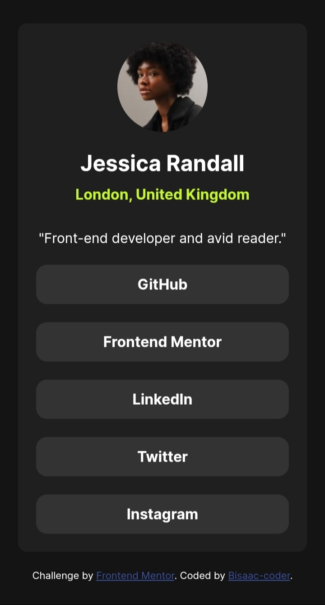

# Frontend Mentor - Social links profile solution

This is a solution to the [Social links profile challenge on Frontend Mentor](https://www.frontendmentor.io/challenges/social-links-profile-UG32l9m6dQ). Frontend Mentor challenges help you improve your coding skills by building realistic projects. 

## Table of contents

- [Overview](#overview)
  - [The challenge](#the-challenge)
  - [Screenshot](#screenshot)
  - [solution links](#solution-links)
- [My process](#my-process)
  - [Built with](#built-with)
  - [What I learned](#what-i-learned)
  - [Continued development](#continued-development)
  - [Useful resources](#useful-resources)
  - [AI Collaboration](#ai-collaboration)
- [Author](#author)
- [Acknowledgments](#acknowledgments)


## Overview
this was a challenge by frontend
 mentor to build a social links profile 
which is identical to the preview.
### The challenge

Users should be able to:

- See hover and focus states for all interactive elements on the page

### Screenshot




 ##solution links

- Solution URL: [Github](https://github.com/Bisaac-coder/social-links-profile-main)
- Live Site URL: [Bisaac-coder](https://your-live-site-url.com)

## My process
I first started with structuring the
html before moving to styling with css.
i used new elements like :
display,
flex-direction,
justify-content,
and 
align.

### Built with

- Semantic HTML5 markup
- CSS internal styles
- Flexbox

### What I learned
I learned how to use the following:
- display:flex : This gave me the pathway to 
using flex property.

- flex-direction: this tell elements
what order they are to stay in weather
in row(horizontal) or column(vertical).

- align-items:This other element where 
to stay on the page ,it can be,start,end
,center.It is for the vertical alignment.

- Text-align: this element is used to
control position of text. 

-  :hover : this is basically the
element which cause your cursor
or backgrond  to change when hovering
above an option or a link.

```html
<!DOCTYPE html>
<html lang="en">
<head>
  <meta charset="UTF-8">
  <meta name="viewport" content="width=device-width, initial-scale=1.0"> <!-- displays site properly based on user's device -->

  <link rel="icon" type="image/png" sizes="32x32" href="./assets/images/favicon-32x32.png">
  
  <title>Frontend Mentor | Social links profile</title>


</head>
<body>
<div class="container">
  
  <span>
    
    <h2 class="name">Jessica Randall</h2>
    
    <h4 class="location">London, United Kingdom</h4>
    
  </span>
  
  <p class="p">"Front-end developer and avid reader."</p>
  
   <div class="options">
    
    <a class="items" href="#">GitHub</a>
    
  <a class="items" href="#">Frontend Mentor</a>
    
  <a class="items" href="#">LinkedIn</a>
    
  <a class="items" href="#">Twitter</a>
    
  <a class="items" href="#">Instagram</a>
    
  </div>
  
  </div>
    
    
  <footer class="attribution">
    Challenge by <a href="https://www.frontendmentor.io?ref=challenge">Frontend Mentor</a>. 
    Coded by <a href="https://www.frontendmentor.io/profile/Bisaac-coder">Bisaac-coder</a>.
  </footer>
</body>
</html>
```
```css
 @font-face {font-family:inter;
    src:url(./Inter-VariableFont_slnt,wght.ttf)
    format("truetype");
  }
  @font-face{font-family:inter-regular;
    src:url(./Inter-Regular.ttf)
    format("truetype");
  }
  @font-face { font-family:inter-bold;
    src:url(./Inter-Bold.ttf) 
    format("truetype");
  }
  
  *{
    margin:0;
    padding:0;
    box-sizing:border-box;
  }
  
  body{
    min-height:100vh;
    background-color:hsl(0, 0%, 8%);
    display:flex;
    flex-direction:column;
    align-items:center;
    justify-content:center;
    gap:20px;
    padding:20px;
    color:hsl(0, 0%, 100%);
    font-family:inter;
  }
  
  .container{
    width:100%;
    max-width:375px;
    
  
    background-color: hsl(0, 0%, 12%);
    padding:20px;
    border-radius:10px;
    display:flex;
    flex-direction:column;
    align-items:center;
    gap:20px;
    text-align:center;
    
  }
  
  .avatar{
    width:100px;
    height:100px;
   border-radius:50px;
  
  }
  
  .name{
    color:hsl(0, 0%, 100%);
    font-family:inter;
    margin-bottom:10px;
  }
  
  .location{
    color:hsl(75, 94%, 57%);
   margin-bottom:10px; 
  }
  
  .p{
    font-size:15px;
  }
  
  .options{
    width:100%;
    gap:16px;
    display:flex;
    flex-direction:column;
    
   
  }
  
  .items{
    background-color:hsl(0, 0%, 20%);
    font-family:inter-bold;
    color:hsl(0, 0%, 100%);
    text-decoration:none;
    padding:12px;
    border-radius:12px;
    
  }
  
  .items:hover,.items:focus-visible{
    background-color:hsl(75, 94%, 57%);
    color:hsl(0, 0%, 8%);
    cursor:pointer;
  }
  
  
    .attribution { font-size: 0.6875rem; text-align: center; }
    .attribution a { color: hsl(228, 45%, 44%); }
```


### Continued development

I would move my focus now to understanding
and improving how I use the flex 
property. And also explore other 
ways to improve.


### Useful resources

- [claude](https://www.claude.com) - This helped me in structuring and using the flex property. I really liked this pattern and will use it going forward.


### AI Collaboration

-  Tools I used?
 Claude
- How I used them?
it was mainly used for brainstorming
solutions and debugging
- What worked well?
brainstorming worked perfectly well
due to the fact that it taught me about
the flex property.
 What didn't?
Nothing.


## Author

- Frontend Mentor - [@Bisaac-coder](https://www.frontendmentor.io/profile/Bisaac-coder)
- Twitter - [@isaackbags](https://www.twitter.com/isaackbags)


## Acknowledgments
special thanks to my mentor and 
motivator kenedy bok ,your encouragement
adds power to my motion.and also to dave gray
for the youtube tutorials html+css,
thanks alot.

